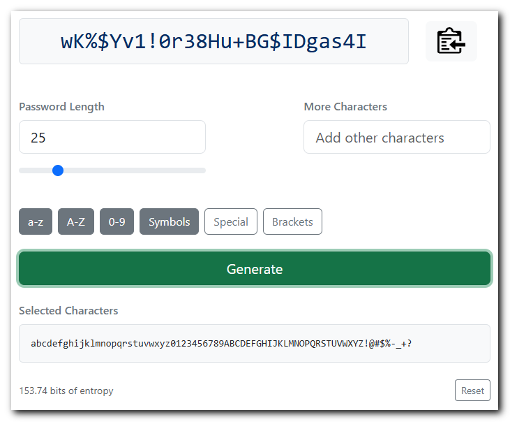

# Password Generator

A simple, static password generator that uses `crypto.getRandomValues()` for cryptographically secure pseudo random numbers.

It can be run locally by opening `public/index.html` in your web browser. All assets are included in the repository so no network connection is required.

Hosted online at https://passgen.danhersam.com

## Usage

* Adjust the password length
* Select the character sets to use or enter additional characters to be used to generate the password
* Click the clipboard button to copy the password to your clipboard

## Built with

* [Vue.js](https://github.com/vuejs/core/releases) - [vue.global.prod.js](https://unpkg.com/browse/vue@latest/dist/)
* [Clipboard.js](https://github.com/zenorocha/clipboard.js/releases)
* [Bootstrap](https://getbootstrap.com/)
